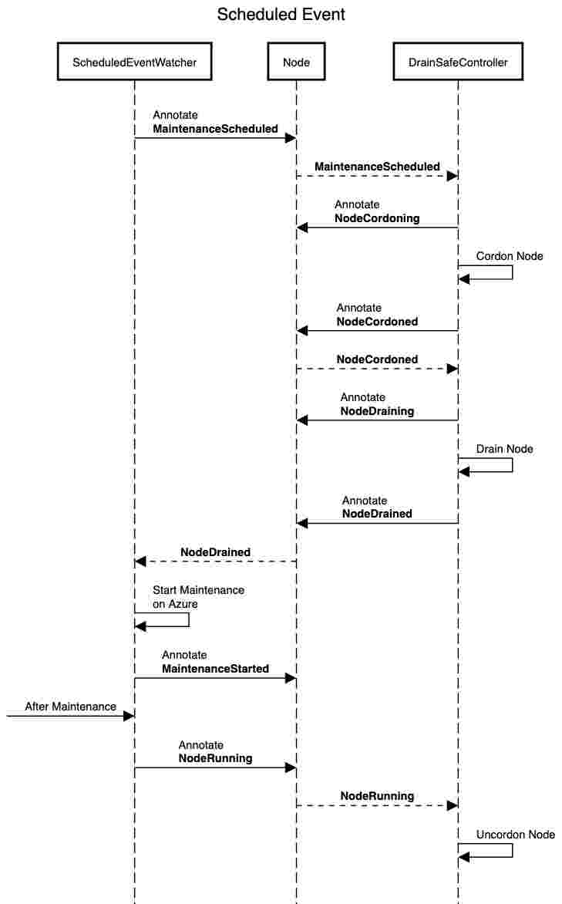

## DrainSafe <!-- omit in toc -->

Azure has a [scheduled events feature](https://docs.microsoft.com/en-us/azure/virtual-machines/linux/scheduled-events) which lets safely drain the workload based on planned/unplanned maintenance events. 

## Table of Contents <!-- omit in toc -->
- [Design](#Design)
  - [Events](#Events)
  - [Node Annotations](#Node-Annotations)
  - [Scheduled Events Controller](#Scheduled-Events-Controller)
  - [Safe drain Controller](#Safe-drain-Controller)
  - [Sequence](#Sequence)
  - [Deploy](#Deploy)
    - [Dependencies](#Dependencies)
    - [Deploy using Kustomize](#Deploy-using-Kustomize)

## Design 

### Events

Following events are defined based on which controllers perform certain actions
- **MaintenanceScheduled** - Maintenance is scheduled  on virtual machine
- **NodeCordoning** - Node is queued for cordoning
- **NodeCordoned** - Scheduling is disabled on virtual machine
- **NodeDraining** - Workload is queued to be drained on virtual machine
- **NodeDrained** - Workload is drained on virtual machine
- **MaintenanceStarted** - Maintenance is started on virtual machine
- **NodeRunning** - Maintenance is completed on virtual machine
- **NodeUncordoned** - Scheduling is enabled on virtual machine

### Node Annotations

We use above event values and annotate the node with current state of actions `drainsafe.azure.com/maintenancestate`

### Scheduled Events Controller

- Runs as a daemonset which watches [scheduled events](https://docs.microsoft.com/en-us/azure/virtual-machines/linux/scheduled-events) for virtual machine its running on.
- Annotates the node with **MaintenanceScheduled** when a maintenance is scheduled.
- Annotates the node with **MaintenanceStarted** Event when a maintenance is started.
- Annotates the node with **NodeRunning** Event when there are no scheduled events at daemonset startup.

### Safe drain Controller

- Runs as a controller watches pre defined [events](#Events) as annotations on kubernetes node.
- Annotates the node with **NodeCordoned** when node has been corded based on **MaintenanceScheduled**.
- Annotates the node with **NodeDrained** when a node has been drained based on **NodeCordoned**.
- Annotates the node with **NodeUncordoned** when node has been uncordened based on **NodeRunning**.

### Sequence

### Deploy

#### Dependencies

- kustomize 2.0

#### Deploy using Kustomize

- `git clone https://github.com/awesomenix/drainsafe`
- `make deploy`